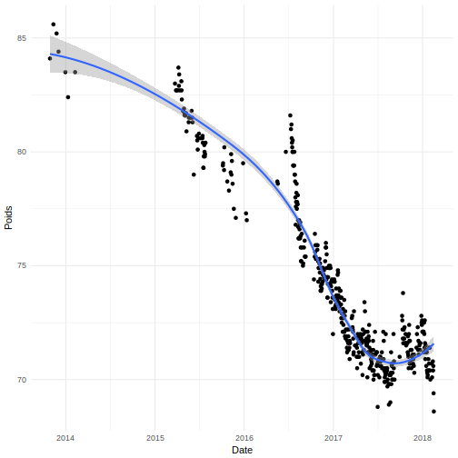

```
## `geom_smooth()` using method = 'loess'
```



Graph over the last 60 measurements:


```
## `geom_smooth()` using method = 'loess'
```


Mean over the last 5 measurements:


```r
mean(tail(poids$Poids))
```

```
## [1] 69.98333
```

Last weight:


```r
tail(poids$Poids, n = 1)
```

```
## [1] 68.6
```

Last bmi:


```r
tail(poids$bmi , n = 1)
```

```
## [1] 22.4
```

Max weight ever 85.6kg (BMI: 28) on the 
2013-11-11 and min weight ever 
68.6kg (BMI: 22) on the 
2018-02-16.

Overall loss (max weight - last weight): 
17kg.

Five last variations: -0.6, 0.7, -0.4, 0.2, -1.2, -0.8. (Total: -2.1kg )

